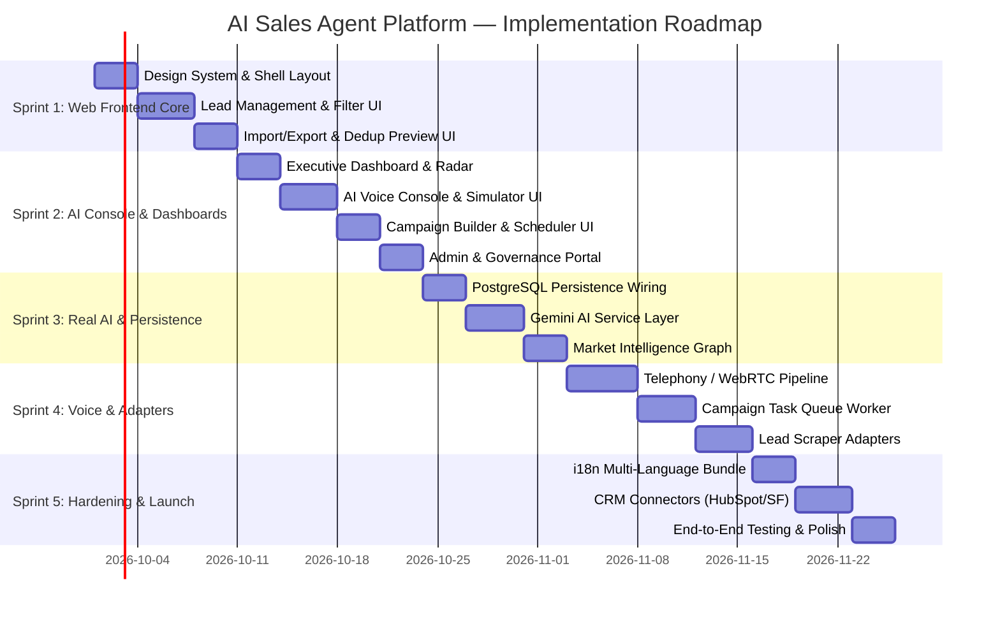

# AI Sales Agent Platform — Master Remaining Work Breakdown

> **Document Type:** Actionable Engineering Work Breakdown & Task Specification  
> **Source of Truth:** [`docs/PRODUCT_REQUIREMENTS.md`](file:///e:/DEGREE/5TH%20SEM/Ai-Sales-agent-master/ai-sales-agent-master/docs/PRODUCT_REQUIREMENTS.md) & [`docs/AI Sales Agent Platform.pdf`](file:///e:/DEGREE/5TH%20SEM/Ai-Sales-agent-master/ai-sales-agent-master/docs/AI%20Sales%20Agent%20Platform.pdf)  
> **Target Scope:** Laptop / Web Platform (Production & Demo Readiness)  
> **Current Status:** Backend Prototype Complete (28.5%) | Remaining Work (71.5%)  

---

## Executive Overview of Modules

The remaining work for the AI Sales Agent Platform is divided into **9 cohesive engineering modules**:

```
┌─────────────────────────────────────────────────────────────────────────────────────────────────┐
│                                  9 CORE ENGINEERING MODULES                                     │
├────────────────────────┬────────────────────────┬───────────────────────────────────────────────┤
│ Module 1: Web Frontend │ Module 2: AI & LLM     │ Module 3: Real Voice & Telephony Pipeline     │
│ UI & Design System     │ Service Layer (Gemini) │ (Twilio / WebRTC / STT / TTS)                 │
├────────────────────────┼────────────────────────┼───────────────────────────────────────────────┤
│ Module 4: Lead         │ Module 5: Enrichment & │ Module 6: Campaign Execution Engine &         │
│ Discovery Engine       │ Market Intelligence    │ Background Task Workers                       │
├────────────────────────┼────────────────────────┼───────────────────────────────────────────────┤
│ Module 7: CRM 2-Way    │ Module 8: Database &   │ Module 9: Internationalization (i18n) &       │
│ Connectors (HubSpot/SF)│ Runtime Persistence    │ Multilingual UI                               │
└────────────────────────┴────────────────────────┴───────────────────────────────────────────────┘
```

---

# MODULE 1: Web Frontend UI & Design System

> **Current Progress:** `0.0%` | **Priority:** `P0 (Critical)`  
> **Target Directory:** `src/app/(dashboard)/`, `src/app/(auth)/`, `src/app/(admin)/`, `src/components/`

### 1.1 Design System, Layout Shell & Navigation
* [ ] **Tailwind & Theme Setup:** Professional dark navy palette, glassmorphism utilities, CSS custom properties for intent indicators (Green: High 80-100, Amber: Medium 50-79, Gray: Low 0-49).
* [ ] **Sidebar Navigation Component:** Responsive navigation drawer with links to Dashboard, Opportunities, Leads, Market Intelligence, Campaigns, Voice Agent, Analytics, Integrations, Billing, Settings, and Admin Portal.
* [ ] **Header Component:** Organization switcher dropdown, active free trial banner, notification bell with unread badge counter, and user profile avatar menu.
* [ ] **Shared UI Primitives (`src/components/ui/`):** Button, Card, Badge, Modal/Dialog, Drawer, Input, Select, Tabs, DropdownMenu, Tooltip, DataTable, and Skeleton loaders.

### 1.2 Authentication & Onboarding Views (Step 1 & Step 2)
* [ ] **Login & Register Pages (`src/app/(auth)/login`, `/register`):** Client registration form with company name, email, password, plan selection, and session cookie setting.
* [ ] **Business Profile & Knowledge Ingestion Wizard (`src/app/(dashboard)/settings`):** Form to input company website URL, company overview, industry, employee headcount, and target ICP criteria.
* [ ] **Business Document Upload Zone:** Drag-and-drop uploader for PDF/DOC sales decks, product catalogs, and case studies.

### 1.3 Product Catalog & AI Suitability Review (Step 6)
* [ ] **Product & Service Management Page:** CRUD interface to add offerings, value propositions, and FAQ pairs for AI training.
* [ ] **Suitability Status Badge:** Visual indicators (`APPROVED`, `PENDING_ADMIN_REVIEW`, `REJECTED`) displaying AI confidence scores.
* [ ] **Admin Product Fallback Approval UI:** Review queue inside Admin Portal for approving/rejecting flagged products with one-click triggers.

### 1.4 Executive Dashboard & AI Opportunity Radar (Steps 3 & 8)
* [ ] **Metric Summary Cards:** Total Discovered Opportunities, Qualified Leads, Active Campaigns, Voice Minutes Used, and Conversion Rate.
* [ ] **AI Opportunity Radar Widget:** High-priority visual feed highlighting hot leads (intent score $\ge 80$) with real-time countdown badges.
* [ ] **Recent Discovery Feed:** Chronological list of incoming requirements tagged with source platform badges (`[LinkedIn]`, `[X]`, `[Company Website]`, etc.) and `[LIVE]` vs `[SIMULATED DEMO SOURCE]` transparency chips.

### 1.5 Lead Management & Multi-Attribute Table (Step 9)
* [ ] **Interactive Lead Table (`src/app/(dashboard)/leads`):** Data table with sorting, pagination, multi-select checkboxes, and column visibility toggles.
* [ ] **Multi-Attribute Filter Bar:** Granular filters for Industry, Company Size, Source Platform, Qualification Status, Lead Status, and Intent Score Slider.
* [ ] **Full-Text Instant Search:** Debounced search across contact name, company name, requirement keywords, and job title.
* [ ] **Lead Detail Slide-Over Drawer:** Comprehensive view displaying all 11 mandatory fields, direct hyperlink to original post URL, contact details, BANT scoring breakdown, and observable signals.
* [ ] **Bulk Action Bar:** Bulk Assign to Campaign, Bulk Update Qualification Status, and Bulk Delete.

### 1.6 CSV / Excel Import & Export Modals
* [ ] **Drag-and-Drop Import Modal:** Upload CSV or `.xlsx` files with automatic column mapping detection.
* [ ] **4-Way Deduplication Preview Table:** Displays valid rows, invalid errors with field highlights, and duplicate conflicts matched by email, phone, LinkedIn URL, or company+name.
* [ ] **Import Confirmation Workflow:** Commits validated records and updates usage metering.
* [ ] **One-Click Export Action:** Dropdown to export filtered leads directly to formatted CSV or Microsoft Excel (`.xlsx`) files.

### 1.7 Market Intelligence & Buying Signal Graph
* [ ] **Opportunity Intelligence Hub (`src/app/(dashboard)/intelligence`):** Visual graph/tree displaying why an opportunity is high-intent through 5 observable signal categories:
  * `requirement_posted`
  * `relevant_hiring`
  * `technology_stack`
  * `company_activity`
  * `decision_maker_identified`
* [ ] **Competitor Dislodgement Radar:** Cards showing competitor mentions and contract renewal timelines.

### 1.8 Campaign Builder & Timezone Scheduler (Steps 10 & 12)
* [ ] **Campaign Creation Wizard (`src/app/(dashboard)/campaigns`):** Multi-step modal to choose campaign type (Leads + Calling vs Calling Only), select lead cohorts, assign voice persona, and configure calling scripts.
* [ ] **Timezone-Aware Scheduling UI:** Visual operational hours selector (`09:00 - 17:00` in prospect local timezone), retry limit counter, voicemail drop toggle, and cadence selector (Immediate / Daily / Weekly / Monthly).
* [ ] **Campaign Lifecycle Controls:** Interactive state machine buttons (`Launch`, `Pause`, `Resume`, `Complete`, `Cancel`).
* [ ] **Campaign Performance View:** Real-time stats cards (Calls Placed, Connect Rate %, Conversion Rate %, Average Duration, Voicemails Dropped).

### 1.9 Interactive AI Voice Agent Console (Step 11)
* [ ] **Live Calling Console (`src/app/(dashboard)/voice`):** Visual phone dialer and campaign call monitor.
* [ ] **Audio Waveform & Live Call Visualizer:** Animated speech indicator differentiating Agent vs Prospect speaking turns.
* [ ] **Real-Time Transcript Feed:** Auto-scrolling speaker bubbles with timestamps.
* [ ] **AI Summary & Sentiment Card:** Executive takeaways, objections raised, prospect sentiment badge (`POSITIVE` / `NEUTRAL` / `NEGATIVE`), and highlighted Next-Best Actions.
* [ ] **Human Handoff Action Center:** Instant "Warm Transfer" action button and calendar booking invite generator.

### 1.10 Sales Analytics & Conversion Funnel (Step 12)
* [ ] **Conversion Funnel Chart:** Recharts area/bar chart tracking `Discovered` $\rightarrow$ `Enriched` $\rightarrow$ `Contacted` $\rightarrow$ `Qualified` $\rightarrow$ `Converted`.
* [ ] **Source Platform Breakdown:** Pie/donut chart comparing conversion rates across LinkedIn, X, Websites, and Directories.
* [ ] **Intent Score Distribution Histogram:** Visual distribution of lead quality.

### 1.11 Administrative & Governance Console (`src/app/(admin)/admin`)
* [ ] **Admin Overview Dashboard:** Platform-wide metrics (total tenants, total users, voice minutes consumed, active scrapers).
* [ ] **User & Seat Management:** Provision, suspend, and assign roles (`ADMIN`, `MANAGER`, `USER`) across organizations.
* [ ] **Security Audit Trail Explorer:** Searchable, immutable audit log table with organization and date filters.
* [ ] **Fraud & Anomaly Alerts Hub:** Real-time feed of detected anomalies (brute force logins, bulk export abuse) with status resolution buttons (`RESOLVED`, `INVESTIGATING`, `DISMISSED`).
* [ ] **System Health & Latency Monitor:** Visual gauges showing database latency, API response times, and telephony uptime.

---

# MODULE 2: AI & LLM Service Layer (`GeminiService`)

> **Current Progress:** `0.0% (Simulated)` | **Priority:** `P1 (High)`  
> **Target File:** `src/lib/ai/gemini-service.ts`

* [ ] **Gemini SDK Setup:** Install `@google/genai` (or `@google/generative-ai`), configure API keys, temperature parameters, and fallback retry handlers.
* [ ] **BusinessAnalyzer Module (Step 2 & 3):** Prompt orchestration to scrape/read client website URL and uploaded document text, synthesizing core value propositions, product offerings, and target market.
* [ ] **ICPGenerator Module (Step 3 & 7):** Generates structured JSON Ideal Customer Profile criteria (target industries, headcount brackets, search keywords, negative exclusions).
* [ ] **RequirementExtractor & Classifier (Step 8):** Analyzes raw public posts/tweets to extract structured commercial buyer requirements and filter out job seekers, spam, and unrelated chatter.
* [ ] **OpportunityMatcher Module:** Computes semantic similarity between client products and discovered buyer requirements, outputting a match score (0–100) and rationale.
* [ ] **Dynamic BANT Scoring Engine:** Evaluates Budget, Authority, Need, and Timeline from post signals and conversation transcripts to generate granular score breakdowns.
* [ ] **Product AI Suitability Scorer (Step 6):** Automated policy compliance checker evaluating ethical and legal suitability for automated voice selling; flags high-risk categories for admin review if confidence $< 0.85$.
* [ ] **Call Summarizer & Sentiment Analyzer (Step 11):** Analyzes full call speech transcripts to produce structured executive summaries, objection logs, sentiment classification, and Next-Best Action recommendations.

---

# MODULE 3: Real Voice, Telephony & Audio Pipeline

> **Current Progress:** `20.0% (Simulation Only)` | **Priority:** `P1 / P2`  
> **Target Directory:** `src/lib/voice/`

* [ ] **Telephony Provider Integration:** Setup Twilio Voice API / Telnyx / SignalWire SDK for programmable outbound dialing and inbound SIP trunk reception.
* [ ] **BYO Telephony Support:** SIP credential registration allowing enterprise clients to bridge existing PBX / Asterisk / FreeSWITCH infrastructure.
* [ ] **Real-Time Speech-to-Text (STT):** Deepgram Nova-2 / Whisper WebSocket streaming integration for low-latency live audio transcription ($<200\text{ms}$).
* [ ] **Conversational Turn Engine:** Ultra-low latency LLM streaming pipeline (Gemini 1.5 Flash / Claude 3.5 Haiku) maintaining conversational state and context-aware FAQ handling.
* [ ] **Streaming Text-to-Speech (TTS):** Cartesia Sonic / ElevenLabs Turbo v2 integration delivering streaming PCM audio in $<200\text{ms}$.
* [ ] **Answering Machine Detection (AMD):** Telephony tone analysis and acoustic classification to detect voicemail greetings and execute automated voicemail drops.
* [ ] **Autonomous Live "Warm Transfer":** SIP conference transfer bridging interested prospects directly to human client sales reps.
* [ ] **Calendar Integration:** Bi-directional Cal.com / Calendly / Google Calendar slot negotiation during voice calls.

---

# MODULE 4: Lead Discovery & Continuous Ingestion Engine

> **Current Progress:** `15.0% (Seed Data Only)` | **Priority:** `P2 (Medium)`  
> **Target Directory:** `src/lib/adapters/`

* [ ] **Abstract `LeadSourceAdapter` Pattern:** Base class with unified methods: `fetchRequirements(query)`, `testConnection()`, `normalizePost(raw)`.
* [ ] **LinkedIn Adapter:** Playwright / API worker to monitor public vendor requests, RFP posts, and hiring announcements.
* [ ] **X (Twitter) Adapter:** Stream search API monitoring commercial intent buying triggers (e.g., *"looking for software agency"*, *"SharePoint migration help"*).
* [ ] **Company Website Adapter:** Headless crawler for `/careers`, `/rfp`, and press releases.
* [ ] **Public Directory Adapter:** Scraper for Clutch, G2, Crunchbase, and vendor directories.
* [ ] **Job Platforms Adapter:** Monitors job boards for tech stack hiring indicating active transformation projects.
* [ ] **Freelance Platforms Adapter:** Ingests Upwork and Freelancer project postings.
* [ ] **Continuous Discovery Scheduler:** Recurring cron runner triggering active adapters and deduplicating new posts against the lead repository.

---

# MODULE 5: Lead Enrichment & Market Intelligence Subsystem

> **Current Progress:** `15.0% (Static Records)` | **Priority:** `P2 (Medium)`  
> **Target Directory:** `src/lib/enrichment/`

* [ ] **Waterfall Enrichment Pipeline:** Sequential API lookup through Apollo, Clearbit, Hunter.io, and People Data Labs to maximize verified contact match rates.
* [ ] **Corporate Email & Phone Verifier:** Real-time SMTP handshake and MX record verification.
* [ ] **Technology Stack Detector:** DNS inspection, HTTP header analysis, and BuiltWith/Wappalyzer API integration.
* [ ] **Funding & Hiring Signals Ingestion:** Webhook feeds from Crunchbase and job boards to detect capital raises and leadership changes.
* [ ] **Buying Signal Correlation Graph:** Correlates multi-source signals into a single confidence rating.

---

# MODULE 6: Campaign Execution Engine & Background Workers

> **Current Progress:** `50.0% (State Machine Only, No Worker)` | **Priority:** `P1 / P2`  
> **Target Directory:** `src/lib/workers/`

* [ ] **Distributed Task Queue:** Setup BullMQ with Redis or Temporal worker cluster.
* [ ] **Timezone-Aware Dispatch Worker:** Evaluates prospect location and current time, dispatching calls strictly within configured windows (e.g. 09:00–17:00 local time).
* [ ] **Retry & Callback Scheduler:** Handles unanswered, busy, and dropped calls with exponential backoff retry cadence.
* [ ] **Concurrency & Telephony Rate Limiter:** Throttles simultaneous calls according to organization seat limits and carrier channel capacity.
* [ ] **Campaign Event Streamer:** Server-Sent Events (SSE) or WebSockets broadcasting real-time calling events to the frontend console.

---

# MODULE 7: CRM Connectors & Two-Way Synchronization

> **Current Progress:** `5.0% (Data Model Only)` | **Priority:** `P3 (Future/Medium)`  
> **Target Directory:** `src/lib/crm/`

* [ ] **HubSpot Integration:** OAuth2 authentication flow, contact/company bi-directional sync, deal creation on qualification.
* [ ] **Salesforce Integration:** Connected App OAuth, lead syncing, task/activity creation on call completion.
* [ ] **Zoho CRM & Pipedrive Connectors:** REST API sync adapters.
* [ ] **Post-Call CRM Auto-Advancement:** Automatic deal stage advancement based on AI call qualification summaries.

---

# MODULE 8: Database Persistence & Production Infrastructure

> **Current Progress:** `60.0% (In-Memory Active / PG Idle)` | **Priority:** `P1 (High)`  
> **Target Directory:** `src/lib/db/`

* [ ] **PostgreSQL Runtime Persistence:** Update [repository.ts](file:///e:/DEGREE/5TH%20SEM/Ai-Sales-agent-master/ai-sales-agent-master/src/lib/db/repository.ts) to execute SQL queries via `pg.Pool` when `DATABASE_URL` is provided, retaining in-memory fallback only for unit tests.
* [ ] **Vector Database & pgvector Extension:** Enable pgvector in PostgreSQL for storing document embeddings and executing cosine similarity RAG searches.
* [ ] **Redis Setup:** Distributed session store, rate limiter backend, and BullMQ task queue storage.
* [ ] **Database Migration Pipeline:** Automated migration execution runner on container startup.
* [ ] **Docker & Deployment Config:** Multi-stage `Dockerfile` and `docker-compose.yml` defining Web App, PostgreSQL, Redis, and Worker containers.

---

# MODULE 9: Internationalization (i18n) & Localization

> **Current Progress:** `0.0%` | **Priority:** `P2 (Medium)`  
> **Target Directory:** `src/messages/`, `src/lib/i18n/`

* [ ] **Frontend i18n Framework:** Install and configure `next-intl` with JSON dictionary bundles for top 10 international languages (English, Spanish, French, German, Mandarin, Hindi, Japanese, Portuguese, Arabic, Italian).
* [ ] **Runtime Language Switcher:** Dropdown in Header allowing seamless language switching without page reload.
* [ ] **Multilingual Voice Prompts:** Parameterized system prompt templates dynamically selecting prospect language during AI voice outreach.

---

## Actionable Sprint Implementation Roadmap



---

## File Summary Checklist for Remaining Work

| Target File | Module | Description | Effort | Priority |
| :--- | :---: | :--- | :---: | :---: |
| `src/components/layout/sidebar.tsx` | M1 | Main responsive navigation drawer | Small | P0 |
| `src/components/layout/header.tsx` | M1 | Organization switcher & alerts header | Small | P0 |
| `src/app/(dashboard)/layout.tsx` | M1 | Dashboard layout wrapper with auth guard | Small | P0 |
| `src/app/(dashboard)/dashboard/page.tsx` | M1 | Executive Dashboard & AI Opportunity Radar | Medium | P0 |
| `src/app/(dashboard)/leads/page.tsx` | M1 | Searchable, filterable Lead Management Table | Medium | P0 |
| `src/app/(dashboard)/campaigns/page.tsx` | M1 | Timezone-aware Campaign Builder & Manager | Medium | P0 |
| `src/app/(dashboard)/voice/page.tsx` | M1 | Interactive AI Voice Console & Simulator | Large | P0 |
| `src/app/(dashboard)/intelligence/page.tsx`| M1 | Market Intelligence & Buying Signal Graph | Medium | P1 |
| `src/app/(dashboard)/analytics/page.tsx` | M1 | Sales Analytics & Conversion Funnel Charts | Small | P1 |
| `src/app/(admin)/admin/overview/page.tsx` | M1 | Admin Portal (Users, Audit, Fraud, Health) | Medium | P0 |
| `src/lib/ai/gemini-service.ts` | M2 | Unified Gemini AI Service & structured LLM | Large | P1 |
| `src/lib/voice/telephony-gateway.ts` | M3 | Twilio / WebRTC streaming voice engine | Large | P1 |
| `src/lib/workers/campaign-worker.ts` | M6 | BullMQ background campaign calling worker | Medium | P1 |
| `src/lib/db/pg-repository.ts` | M8 | Real PostgreSQL SQL query repository | Medium | P1 |
| `src/lib/adapters/linkedin-adapter.ts` | M4 | Playwright LinkedIn public post scraper | Large | P2 |
| `src/lib/crm/hubspot-connector.ts` | M7 | HubSpot OAuth & two-way sync connector | Medium | P3 |
