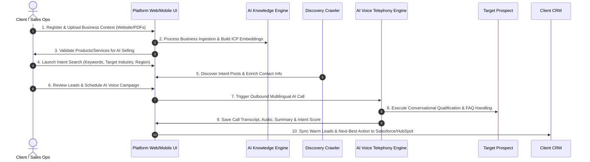
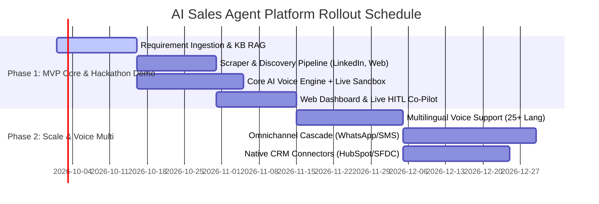

# Product Requirement Document (PRD)

## Project Title: AI Sales Agent Platform
**Document Version:** 1.0.0  
**Status:** Draft / Ready for Review  
**Author:** Futurrizon Technologies Team & AI Solution Architect  
**Date:** September 25, 2026  
**Target Audience:** Engineering, Product, AI/ML Infrastructure, Sales Operations, Leadership  

---

## 1. Executive Summary & Product Vision

### 1.1 Vision Statement
To revolutionize B2B sales development by building an autonomous, end-to-end **AI Sales Intelligence & Voice Agent Platform** that continuously discovers active buyer intent across public channels, enriches target profiles, and engages prospects through natural, human-like multilingual AI voice calls—transforming cold prospecting into qualified sales conversations automatically.

### 1.2 Problem Statement
- **Time-Consuming Manual Prospecting:** B2B sales teams spend over 65% of their time searching for buyers, verifying contact details, and making repetitive cold outreach calls.
- **Outdated Static Databases:** Traditional lead databases contain stale contacts without explicit buying intent, leading to low conversion rates (< 2%).
- **Scaling Bottlenecks in Calling:** Manual phone outreach is expensive, hard to scale across multiple languages and time zones, and suffers from low answer rates and inconsistent pitch quality.

### 1.3 Core Solution & Value Proposition
The platform combines:
1. **Real-time Intent-Driven Discovery:** Scanning public channels (LinkedIn, X, freelancing platforms, directories) for explicit buyer requirement posts.
2. **Deep Prospect & Market Enrichment:** Automatically enriching intent signals with verified contact info, tech stack, funding, and hiring trends.
3. **Autonomous Multilingual AI Voice Outreach:** Conducting low-latency, natural inbound/outbound phone conversations to qualify intent, answer FAQs, handle objections, and schedule follow-ups.
4. **Seamless Handoff:** Transferring warm, qualified opportunities with complete call transcripts and audio records directly into client CRMs.

---

## 2. Key Performance Indicators (KPIs) & Success Metrics

| Metric Category | Target KPI | Benchmark / Objective |
| :--- | :--- | :--- |
| **Discovery Accuracy** | ≥ 92% Intent Precision | Ratio of discovered posts matching true ICP requirements vs false positives. |
| **Voice Call Latency** | < 800ms turn-taking | E2E speech-to-speech response delay (STT + LLM + TTS). |
| **Call Qualification Rate**| 15% - 25% | Percentage of completed calls resulting in qualified leads or booked meetings. |
| **Contact Data Accuracy** | ≥ 95% Deliverability | Verified email and direct dial phone number accuracy. |
| **System Availability** | 99.9% Uptime | Voice gateway and platform API availability. |

---

## 3. User Personas & Stakeholder Mapping

### Persona 1: Sarah — Sales Operations Manager (Primary User)
- **Role:** Sets up campaigns, configures ICP profiles, monitors campaign conversion metrics, and manages lead lists.
- **Pain Point:** Frustrated by low SDR output, bad lead data, and manual CRM uploads.
- **Needs:** Automated lead discovery, batch campaign scheduling, real-time campaign performance dashboards, clean CRM sync.

### Persona 2: Alex — Senior Sales Development Rep / Account Executive
- **Role:** Receives pre-qualified leads and conducts closing calls.
- **Pain Point:** Wastes time calling uninterested prospects who haven't expressed buyer intent.
- **Needs:** Full context on lead source, transcript summary, call recording, and recommended next action prior to follow-up call.

### Persona 3: Marcus — VP of Sales / Enterprise Administrator (Buyer)
- **Role:** Manages subscription billing, platform seats, AI voice minutes, compliance, and ROI.
- **Pain Point:** Uncontrolled sales tech stack spend and lack of visibility into outreach compliance (TCPA/GDPR).
- **Needs:** Centralized governance, voice minute metering, audit logging, role-based access control (RBAC), and clear attribution ROI metrics.

---

## 4. End-to-End User Journey & Workflow Diagram



---

## 5. Detailed Epic & Functional Requirements Breakdown

### Epic 1: AI Business Ingestion & Knowledge Base Management

> **Goal:** Ingest client company collateral (website, pitch decks, FAQs, pricing) to train the AI Voice Agent on specific product knowledge.

#### User Stories & Features
- **FR-1.1 Context Ingestion Pipeline:**
  - Support input of company URL, PDF documents, Google Docs, and custom text inputs.
  - Automatically crawl client website subpages (up to 50 pages) and construct a Vector RAG Knowledge Base.
- **FR-1.2 Service Validation Engine:**
  - Automated safety & policy check evaluating if products/services meet platform terms for AI phone selling.
  - *Fallback Rule:* If automated score is ambiguous (between 0.40 and 0.70 confidence), flag for manual Admin Review with notification.
- **FR-1.3 Buyer Persona Configuration:**
  - Client can define target industries, target job titles, geography, company size filters, and exclusionary keywords.

---

### Epic 2: AI Lead Discovery & Requirement Parsing

> **Goal:** Continuously scan public web sources to surface active requirement posts and extract buyer metadata.

#### Features & Technical Requirements
- **FR-2.1 Multi-Source Crawler:**
  - Scan public requirement feeds from LinkedIn, X (Twitter), Company Career/Procurement sites, Public Tender Directories, and Freelance networks (Upwork, Fiverr, Toptal).
- **FR-2.2 Intent Requirement Parser:**
  - Extract key entities from unstructured posts: *Post Text*, *Original Source URL*, *Platform*, *Publication Timestamp*, *Required Service/Tech Stack*, *Urgency Level*.
- **FR-2.3 Source Transparency Guarantee:**
  - **Mandatory Requirement:** Every discovered prospect record MUST store and display the direct `original_post_url` and `source_platform` badge.

---

### Epic 3: Lead Enrichment & Market Intelligence

> **Goal:** Enrich discovered requirement posts with verified business contact details and firmographic insights.

#### Data Schema Requirements
Each lead profile must be enriched with:

| Field Name | Type | Description |
| :--- | :--- | :--- |
| `prospect_name` | String | Full name of the requirement poster/contact. |
| `job_title` | String | Current job title (e.g., "Director of IT"). |
| `company_name` | String | Organization name. |
| `company_website` | URL | Verified primary domain. |
| `business_email` | String (Verified) | Work email validated via SMTP ping/lookup. |
| `phone_number` | Phone E.164 | Direct dial or mobile number if publicly available. |
| `company_size` | Enum | 1-10, 11-50, 51-200, 201-500, 500-1000, 1000+. |
| `industry` | String | Primary business industry classification. |
| `market_intel` | JSON Object | Tech stack detected, recent funding round, hiring signals. |

---

### Epic 4: Autonomous Multilingual AI Voice Agent Engine

> **Goal:** Execute natural, interactive phone calls for prospect qualification, inbound inquiry handling, and callback scheduling.

```
       +-------------------------------------------------------------+
       |               AI Voice Agent Telephony Architecture          |
       +-------------------------------------------------------------+
                                      |
     +-------------------+    +--------------------+    +--------------------+
     | Realtime STT      | -> | Orchestration LLM  | -> | High-Fidelity TTS  |
     | Deepgram / Whisper|    | GPT-4o / Claude    |    | ElevenLabs/Cartesia|
     +-------------------+    +--------------------+    +--------------------+
                                      |
                                      v
                      +-------------------------------+
                      | Telephony Gateway (SIP/WebRTC)|
                      | Twilio / Retell AI / Vapi     |
                      +-------------------------------+
```

#### Detailed Voice Features:
- **FR-4.1 Natural Low-Latency Voice Stack:**
  - Turn-taking latency must not exceed **800 milliseconds**.
  - Natural interruption handling (barge-in support) allowing human prospect to cut off AI speech naturally.
- **FR-4.2 Multilingual Capability:**
  - Support automatic language detection and fluent switching across 25+ major global languages (English, Spanish, French, German, Hindi, Arabic, Japanese, etc.).
- **FR-4.3 Conversation Logic & Capabilities:**
  - **Outbound Calling:** Introduce client solution, reference discovered requirement post context, ask qualifying questions.
  - **Inbound FAQ & Callback:** Handle inbound prospective calls, answer company FAQs from Knowledge Base, take callbacks.
  - **Voicemail Detection & Action:** Detect automated answering machines. If voicemail detected, leave customizable voice drop message or hang up based on campaign settings.
  - **Unanswered Call Handling:** Automatic retry schedule (up to N configurable attempts over X days, strictly respecting local timezone business hours).
- **FR-4.4 Post-Call Intelligence:**
  - Automatic generation of verbatim text transcript, call audio recording download, key takeaway summary, sentiment analysis (Positive/Neutral/Negative), and **Next-Best Action Recommendation**.

---

### Epic 5: Campaign Management & Lead Governance

> **Goal:** Enable clients to structure, schedule, and execute targeted outreach campaigns.

#### Features
- **FR-5.1 Timezone-Aware Scheduler:**
  - Outbound calls automatically throttled to execute strictly within local business hours (e.g., 9:00 AM – 5:00 PM in prospect's local timezone).
- **FR-5.2 Campaign Segmentation & Filtering:**
  - Filter leads by score, industry, intent keyword, discovery date, and contact availability.
- **FR-5.3 CSV/Excel Import & Deduplication:**
  - Allow client to upload external lead lists (.csv/.xlsx).
  - Automatically deduplicate against existing platform contacts based on email and phone number normalization.

---

### Epic 6: Admin, Governance, & Voice Minute Metering

> **Goal:** Provide enterprise administrators full control over platform usage, billing, and compliance.

#### Features
- **FR-6.1 Multi-Tenant Subscription Tiering:**
  - **Starter Tier:** Up to 500 enriched leads/mo, 100 AI Voice minutes/mo.
  - **Growth Tier:** Up to 2,500 enriched leads/mo, 500 AI Voice minutes/mo, CRM 2-way sync.
  - **Enterprise Tier:** Custom lead volume, unlimited seats, dedicated telephony gateway, SLA support.
- **FR-6.2 Usage Metering & Wallet:**
  - Real-time billing meter tracking AI Voice Call Minutes (in 6-second increments) and API contact enrichment calls.
- **FR-6.3 Security & Compliance Logging:**
  - Immutable audit log recording user actions, export events, call recordings access, and role modifications.
  - **TCPA / DNC Filtering:** Built-in National Do Not Call (DNC) registry checking before placing outbound dials.

---

## 6. Non-Functional Requirements (NFRs)

### 6.1 Performance & Voice Telephony
- **Turn-taking Speech Latency:** E2E audio-to-audio latency target: **< 800ms** (STT < 200ms, LLM < 300ms, TTS < 250ms, network < 50ms).
- **Concurrent Voice Calls:** System backend must support up to **5,000 simultaneous outbound voice calls** without degradation in speech synthesis quality.

### 6.2 Security & Compliance
- **Data Encryption:** TLS 1.3 in transit; AES-256 for call recordings, transcripts, and credentials at rest.
- **Regulatory Adherence:** Full compliance with GDPR, CCPA, and TCPA (Telecommunications Consumer Protection Act).
- **Data Privacy:** Option for enterprise tenants to enforce zero data retention on LLM provider calls.

### 6.3 Reliability & Availability
- **System Uptime:** 99.9% availability for core REST APIs and Dashboard.
- **Call Fallback:** If primary speech synthesizer drops, auto-failover to backup TTS provider within 1.5 seconds without dropping the telephony connection.

---

## 7. Recommended Technology Stack & Architecture

```
+-----------------------------------------------------------------------------------+
|                                  CLIENT LAYER                                     |
|    Next.js 14 Web Portal  |  React Native iOS & Android  | REST / GraphQL SDK    |
+-----------------------------------------------------------------------------------+
                                         |
+-----------------------------------------------------------------------------------+
|                                  API GATEWAY                                      |
|                       Kong / NGINX / Cloudflare API Shield                        |
+-----------------------------------------------------------------------------------+
                                         |
+-----------------------------------------------------------------------------------+
|                               MICROSERVICES LAYER                                 |
|  +--------------------+  +--------------------+  +-----------------------------+  |
|  | Discovery & Scraper|  | Enrichment Engine  |  | AI Voice Orchestrator       |  |
|  | Node.js / Playwright|  | Python / FastAPI   |  | WebSockets / Redis Streams  |  |
|  +--------------------+  +--------------------+  +-----------------------------+  |
+-----------------------------------------------------------------------------------+
                                         |
+-----------------------------------------------------------------------------------+
|                                DATA & STORAGE LAYER                               |
|   PostgreSQL (RDS)   |   Redis (Cache/Queue)  |   Qdrant (Vector DB)  | AWS S3  |
+-----------------------------------------------------------------------------------+
```

---

### Epic 7: Hackathon-Winning Uniqueness & AI Differentiators

> **Goal:** Outperform all competing hackathon teams by introducing state-of-the-art AI capabilities that solve real enterprise sales pain points.

#### 🌟 Feature 7.1: Live Human Co-Pilot & Whisper Mode (HITL Takeover)
- **Live Stream Transcription:** Sales Reps can observe a real-time speech-to-text transcript of active AI voice calls directly inside the dashboard.
- **Whisper Mode:** Reps can type real-time advice or answers to difficult objections into a "Whisper Console". The AI incorporates this context into its next speech turn without the prospect knowing.
- **1-Click Call Takeover:** A single click instantly bridges the human sales rep into the live WebRTC call session, demoting the AI to silent note-taker.

#### 🌟 Feature 7.2: DISC Personality Engine & Dynamic Pitch Shaping
- **Pre-Call Sentiment Extraction:** Analyzes prospect's original requirement post syntax, job title, and company culture to predict buyer persona (*Driver, Analytical, Expressive, Amiable*).
- **Adaptive Speech Synthesis:** The AI dynamically adjusts its tone, speaking pace, and vocabulary (e.g. ROI & metrics for *Analyticals*, speed & conciseness for *Drivers*).

#### 🌟 Feature 7.3: Omnichannel Fallback Cascade (Smart Engagement Engine)
- If an outbound AI Voice call is unanswered or hits voicemail:
  1. Automatically generate a personalized **WhatsApp / SMS Voice Note** quoting their exact requirement post.
  2. Send an automated **LinkedIn Connection Request & AI Video Pitch** personalized to their company stack.

#### 🌟 Feature 7.4: Browser-Based Live AI Voice Testing Sandbox
- Judges/Evaluators can test the AI agent live directly in the web app via WebRTC without needing a physical phone call, experiencing sub-600ms latency firsthand.

---

## 8. Milestone & Phased Delivery Roadmap



---

## 9. Unique Selling Proposition (USP) Matrix

| Feature Dimension | Traditional Tools (Apollo/ZoomInfo) | Standard AI Callers (Bland/Retell) | **Our Winning Hackathon Platform** |
| :--- | :--- | :--- | :--- |
| **Lead Discovery** | Static database lists | Manual CSV upload required | **Real-time public post intent mining** |
| **Call Co-Pilot** | None | No human intervention during call | **Live HITL Call Takeover + Whisper Mode** |
| **Pitch Personalization**| Standard template | Fixed script prompt | **DISC Personality Engine + Intent Tuning** |
| **Unanswered Call Flow**| Manual retry | Re-dial phone later | **Omnichannel Voice Note (WhatsApp + InMail)** |
| **Interactive Demo** | Static slides | Phone call needed | **In-Browser WebRTC AI Call Sandbox** |

---

## 10. Summary & Sign-Off Criteria

This Product Requirement Document (PRD) establishes the standard for the development of the **AI Sales Agent Platform**. 

**Acceptance Criteria for Phase 1 Release:**
1. Successful ingestion of client company URL with RAG search response time < 300ms.
2. Automated lead discovery from at least 3 public sources displaying verifiable `original_post_url`.
3. Outbound AI voice agent call completion in English with total speech-to-speech turn latency under 800ms.
4. Live Human Co-Pilot takeover demo working seamlessly in the web browser.
5. Auto-generation of structured call summaries, sentiment scores, and verbatim transcripts upon call completion.

